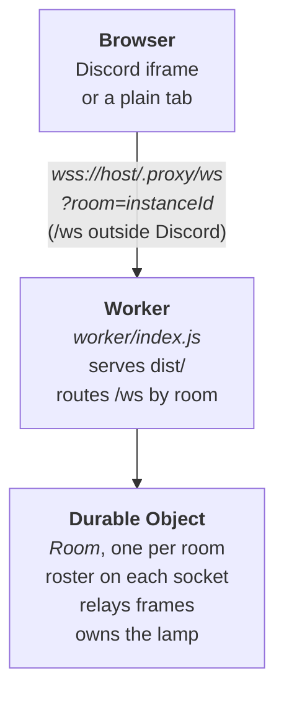

# Blobspace · spike 01

A shared isometric room you enter from Discord. Stick figures walk around.
Typed words leave a figure's head one character at a time, drift and fade
within about four seconds, and arrive for everyone else with the typist's
hesitations intact. There is one lamp anyone can switch.

**Live:** https://blobspace-spike-01.alex-hortfrancis.workers.dev/

Plain tabs share the room `local`; add `?room=<name>&name=<you>` to choose.
Inside Discord the room is the Activity's `instanceId`, shown in the status
line, so a browser tab given that room joins the Discord session.

This was a spike to answer five questions before building a prototype. All
five came back **yes**. The design is in [SPEC.md](SPEC.md); the verdicts, with
measurements and surprises, are in [PROGRESS.md](PROGRESS.md).

| # | Question | Verdict |
| --- | --- | --- |
| 1 | Does a long-lived `wss://` survive Discord's proxy? | yes |
| 2 | Do several people moving on one floor feel shared? | yes |
| 3 | Do figures with interpolation read as a room? | yes |
| 4 | Do the gaps between typed characters survive the network? | yes |
| 5 | Does world state sync the way people do? | yes |

## Stack

- **Client:** plain JS, Three.js 0.186 (locked orthographic camera; all text is
  DOM through `CSS2DRenderer`), Discord Embedded App SDK 2.5, built with Vite 8.
- **Server:** one Cloudflare Worker that serves the built client and routes
  `/ws` to a Durable Object per room, using the WebSocket Hibernation API.
- **Config:** only the public Discord application ID, in `.env`. No secrets yet.



## What is worth reusing

| Finding | Where |
| --- | --- |
| A long-lived `wss://` holds through Discord's proxy at `/.proxy/ws`. Sockets left silent for 10 minutes survived, so no keepalive is needed. | `src/room.js` |
| Keep per-player state on the socket with `serializeAttachment` and rebuild the roster from `getWebSockets()`: hibernation empties memory. | `worker/index.js` |
| Hibernated sockets got **no** automatic reply to a Close frame, despite `web_socket_auto_reply_to_close`. Reply in `webSocketClose`, mapping 1005, 1006 and 1015 to 1000. | `worker/index.js` |
| Speech timing survives: send each character with `dt`, the ms since the previous one, taken from `event.timeStamp` and counted across frames. Replay each at `max(now + 150 ms, previous due + dt)`. Gaps matched to within a frame of the measuring browser, locally and live. | `src/main.js` (`hear`), `src/speech.js` |
| Smooth remote movement: draw 150 ms behind, between snapshots placed on the **sender's** clock (`ts`), with the clock offset taken from the quickest delivery. The sender carries its position forward to the moment of sending. Spacing by arrival, or sampling position once per tick, both stuttered visibly. | `src/main.js` (`place`, `sample`, `currentPosition`) |
| Shared objects need an authority. The room stores the lamp in `ctx.storage` and tells everyone, the asker included. Requests name a state (`on: true`), not a toggle, so simultaneous presses agree. | `worker/index.js`, `src/lamp.js` |
| `CSS2DRenderer` in three 0.186 rewrites every element's `display` each frame. Hide a label through its object's `visible`, not its style. | `src/lamp.js` |
| The stick figure as a cloneable template, with a shirt per person and walk and talk animation. | `src/figure.js` |

## Files

| Path | What |
| --- | --- |
| `worker/index.js` | Worker router, and the `Room` Durable Object: hello, joined and left; frame validation and relay; the lamp. |
| `src/main.js` | The client: Discord handshake, input, local movement, remote interpolation, speech queueing and replay. |
| `src/room.js` | The socket: Discord's `/.proxy/` path, and reconnecting with backoff. |
| `src/world.js` | Renderer, locked isometric camera, lights, 10 × 10 floor. |
| `src/figure.js` | Stick figure, from `threejs-experiments-01/05`. |
| `src/speech.js` | Drifting single-character speech, one speaker per person. |
| `src/lamp.js` | The shared lamp, with prompt, reach and collision, from `06`. |
| `src/dot.js` | Step two's sphere person. Unused, kept for reference. |
| `index.html` | Page shell and all CSS. |

## Wire

JSON over one WebSocket per player.

```js
// client → room
{ t: "frame", p: [x, z, yaw], ts, s: [{ c, dt }] } // p and ts every tick while moving, and once on stopping; s while typing
{ t: "lamp", on: true }

// room → clients
{ t: "hello", you, peers: [{ id, name, p }], world: { lamp } } // to the new arrival
{ t: "joined", id, name }                                      // to everyone else
{ t: "left", id }
{ t: "frame", id, p, ts, s }                                   // to everyone but the sender
{ t: "lamp", on, by }                                          // to everyone
```

The room checks each part on its own and drops only what is malformed: `p` is
three finite numbers, `ts` a number ≥ 0 beside `p`, `s` 1 to 64 characters of
one or two UTF-16 units each, with `dt` null (the first) or ≥ 0.

## Run

```sh
npm install
cp .env.example .env   # VITE_DISCORD_CLIENT_ID=<application id>
npm run dev            # vite build && wrangler dev → http://localhost:8787; open two tabs
npm run deploy         # vite build && wrangler deploy
```

In Discord: Developer Portal → the application → Activities → URL Mappings,
map `/` to the workers.dev host, then launch the Activity from a server.

Arrow keys walk. Typing speaks, and there is no backspace. Enter beside the lamp
switches it.

## Test

```sh
npm run test:room      # the protocol over raw sockets; WS_URL= to aim elsewhere
npm run test:browser   # real tabs in headless Chromium; APP_URL= to aim elsewhere
```

What each checks, and how far to trust browser timings: [tests/README.md](tests/README.md).

## Not done, and needed for a prototype

- **Identity.** Everyone is a guest: the room assigns ids and takes `name` from
  the query string. The OAuth exchange and signed ticket in SPEC.md are not built.
- **Access.** Anyone who knows a room name can join it.
- **Tests.** The verification scripts are in `tests/`, but they are scripts, not
  a suite: no CI, and the browser tests' timings depend on the machine.
- **Untested:** two real Discord accounts in one instance, the Discord desktop
  and mobile apps, and Discord's own shortcuts while the Activity has focus.
- Speech letter spacing varies slightly per viewer, as it depends on frame
  timing; accepted. Shirt colours come from an id hash and often clash.
- The `local` room's lamp is stored indefinitely. Nothing else persists.
- The client bundle is about 710 kB, with Three.js unsplit.
